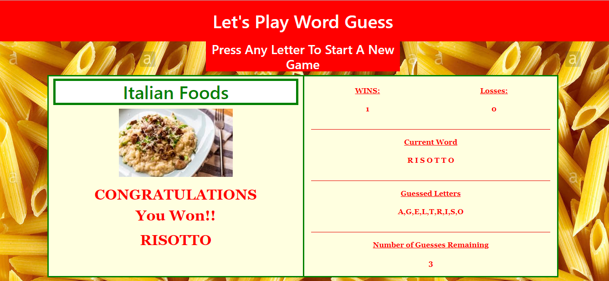

# Word-Guess
Homework #3 Javascript Assignment
Rhonda Johnson

Link to deployed project
https://rmxjohnson.github.io/Word-Guess/

The program uses bootstrap along with a custom style.css.
The program uses javascript to dynamically update the page with current guesses, counts, and images.

This project allows the user to play a Word Guess (Hangman) game.
User has 12 tries to guess the word.
An array of wordItems holds a word and a corresponding image (pizza; image of pizza)
The user guesses are held in a guess array.  
The letters in the guess array are compared to the letters in the current game word.  
The game is over when the user runs out of guesses or when all the letters in the game word have been correctly selected by the user.
When the game is over, the correct word and its corresponding image are displayed on the page.

## Home Page

	

    

